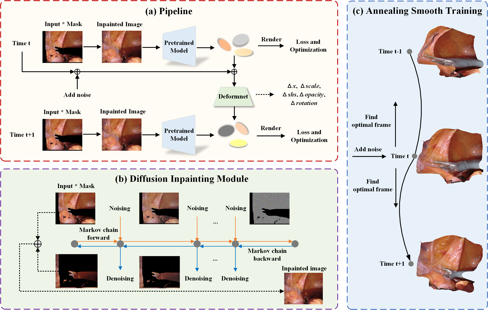

## **DiGS: Diffusion-guided Gaussian Splatting for Dynamic Occlusion Surgical Scene Reconstruction**

### Architecture



### Environments

```shell
conda create -n DiGS python=3.7 
conda activate DiGS

pip install -r requirements.txt
pip install -e submodules/depth-diff-gaussian-rasterization
pip install -e submodules/simple-knn
pip install torch==2.0.0 torchvision==0.15.1 torchaudio==2.0.1 --index-url https://download.pytorch.org/whl/cu118

```

### Datasets

We used two datasets for training and evaluation:  [EndoNeRF](https://docs.google.com/forms/d/e/1FAIpQLSfM0ukpixJkZzlK1G3QSA7CMCoOJMFFdHm5ltCV1K6GNVb3nQ/viewform) dataset and [StereoMIS](https://zenodo.org/records/7727692) dataset.

The data structure is as follows:

```
./data
├── endonerf
│    ├── cutting_tissues_twice
│    │    └── ...
│    ├── pulling_soft_tissues
│    │    └── ...
│    └── ...
└── stereomis
│    ├── P1
│    │    └── ...
│    ├── P2_0
│    │    └── ...
│    └── ...
```

##### How to download pre-trained depth prediction model:

please refer to [depth_anything_vits14.onnx](https://github.com/fabio-sim/Depth-Anything-ONNX/releases)

##### How to prepare StereoMIS dataset:

```shell
sh prepare_stereomis.sh
```

##### How to generate inpainted image:

 please refer to [RePaint](https://github.com/andreas128/RePaint)

##### How to pre-process dataset:

```shell
sh prepare_depth.sh
```

### Training

```shell
sh train.sh
```

### Evaluation

```shell
# render
sh render.sh
# evaluate
sh eval.sh
```

### Acknowledgement

Our code is based on the implementation of [RePaint](https://github.com/andreas128/RePaint), [Endo4DGS](https://github.com/lastbasket/Endo-4DGS), [diff-gaussian-rasterization-depth](https://github.com/leo-frank/diff-gaussian-rasterization-depth), [Depth-Anything-ONNX](https://github.com/fabio-sim/Depth-Anything-ONNX).
